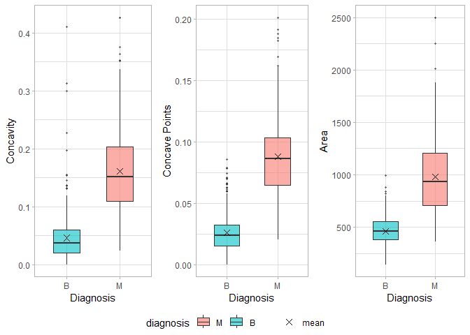
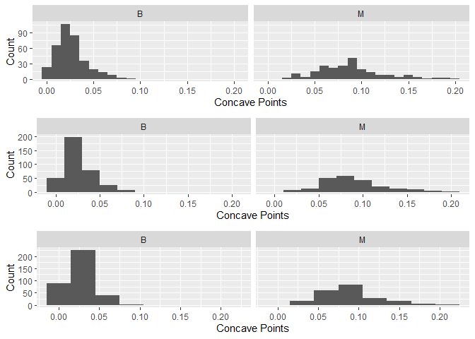
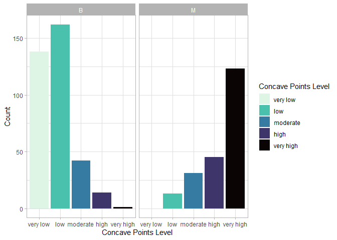
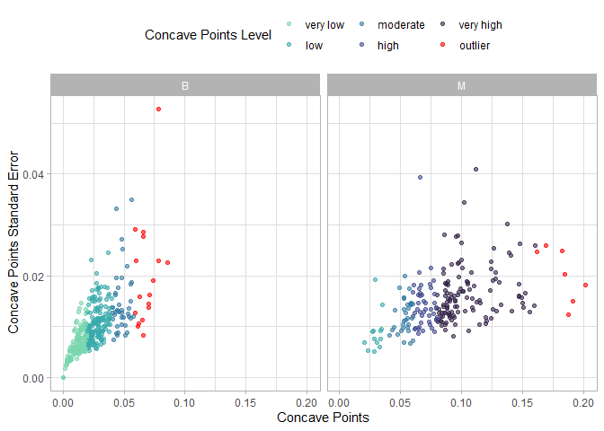
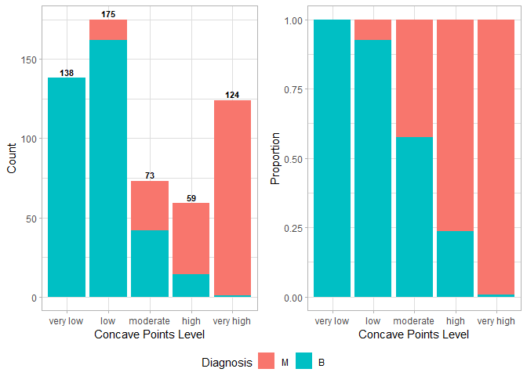

Mini Data Analysis Milestone 2
================

*To complete this milestone, you can either edit [this `.rmd`
file](https://raw.githubusercontent.com/UBC-STAT/stat545.stat.ubc.ca/master/content/mini-project/mini-project-2.Rmd)
directly. Fill in the sections that are commented out with
`<!--- start your work here--->`. When you are done, make sure to knit
to an `.md` file by changing the output in the YAML header to
`github_document`, before submitting a tagged release on canvas.*

# Welcome to the rest of your mini data analysis project!

In Milestone 1, you explored your data. and came up with research
questions. This time, we will finish up our mini data analysis and
obtain results for your data by:

- Making summary tables and graphs
- Manipulating special data types in R: factors and/or dates and times.
- Fitting a model object to your data, and extract a result.
- Reading and writing data as separate files.

We will also explore more in depth the concept of *tidy data.*

**NOTE**: The main purpose of the mini data analysis is to integrate
what you learn in class in an analysis. Although each milestone provides
a framework for you to conduct your analysis, it’s possible that you
might find the instructions too rigid for your data set. If this is the
case, you may deviate from the instructions – just make sure you’re
demonstrating a wide range of tools and techniques taught in this class.

# Instructions

**To complete this milestone**, edit [this very `.Rmd`
file](https://raw.githubusercontent.com/UBC-STAT/stat545.stat.ubc.ca/master/content/mini-project/mini-project-2.Rmd)
directly. Fill in the sections that are tagged with
`<!--- start your work here--->`.

**To submit this milestone**, make sure to knit this `.Rmd` file to an
`.md` file by changing the YAML output settings from
`output: html_document` to `output: github_document`. Commit and push
all of your work to your mini-analysis GitHub repository, and tag a
release on GitHub. Then, submit a link to your tagged release on canvas.

**Points**: This milestone is worth 50 points: 45 for your analysis, and
5 for overall reproducibility, cleanliness, and coherence of the Github
submission.

**Research Questions**: In Milestone 1, you chose two research questions
to focus on. Wherever realistic, your work in this milestone should
relate to these research questions whenever we ask for justification
behind your work. In the case that some tasks in this milestone don’t
align well with one of your research questions, feel free to discuss
your results in the context of a different research question.

# Learning Objectives

By the end of this milestone, you should:

- Understand what *tidy* data is, and how to create it using `tidyr`.
- Generate a reproducible and clear report using R Markdown.
- Manipulating special data types in R: factors and/or dates and times.
- Fitting a model object to your data, and extract a result.
- Reading and writing data as separate files.

# Setup

Begin by loading your data and the tidyverse package below:

``` r
library(datateachr) #contains data sets for analysis
library(tidyverse) #contains packages for wrangling, visualizing, tidying, reading and writing data
library(ggpubr) #includes `ggarrange()` function to graph multiple ggplot2 plots in the same figure
library(rstatix) #includes `identify_outliers()` function to identify outliers
library(here) #includes `here()` function to use relative paths to/from this project
```

# Task 1: Process and summarize your data

From milestone 1, you should have an idea of the basic structure of your
dataset (e.g. number of rows and columns, class types, etc.). Here, we
will start investigating your data more in-depth using various data
manipulation functions.

### 1.1 (1 point)

First, write out the 4 research questions you defined in milestone 1
were. This will guide your work through milestone 2:

<!-------------------------- Start your work below ---------------------------->

#### Research questions defined in milestone 1

1.  Which variable is the strongest indicator of diagnosis?  
2.  Is there a numerical range of this variable that can define a benign
    vs. malignant sample?  
3.  Do samples with large margins of error (SE value) still align with
    the above ranges of benign vs. malignant?  
4.  For discrete ranges of this variable, what is the likelihood that
    the sample is benign vs. malignant?

***Note:** I have replaced the term “attribute” with “variable” to more
accurately reflect the columns as numerical data.*
<!----------------------------------------------------------------------------->

Here, we will investigate your data using various data manipulation and
graphing functions.

### 1.2 (8 points)

Now, for each of your four research questions, choose one task from
options 1-4 (summarizing), and one other task from 4-8 (graphing). You
should have 2 tasks done for each research question (8 total). Make sure
it makes sense to do them! (e.g. don’t use a numerical variables for a
task that needs a categorical variable.). Comment on why each task helps
(or doesn’t!) answer the corresponding research question.

Ensure that the output of each operation is printed!

Also make sure that you’re using dplyr and ggplot2 rather than base R.
Outside of this project, you may find that you prefer using base R
functions for certain tasks, and that’s just fine! But part of this
project is for you to practice the tools we learned in class, which is
dplyr and ggplot2.

**Summarizing:**

1.  Compute the *range*, *mean*, and *two other summary statistics* of
    **one numerical variable** across the groups of **one categorical
    variable** from your data.
2.  Compute the number of observations for at least one of your
    categorical variables. Do not use the function `table()`!
3.  Create a categorical variable with 3 or more groups from an existing
    numerical variable. You can use this new variable in the other
    tasks! *An example: age in years into “child, teen, adult, senior”.*
4.  Compute the proportion and counts in each category of one
    categorical variable across the groups of another categorical
    variable from your data. Do not use the function `table()`!

**Graphing:**

6.  Create a graph of your choosing, make one of the axes logarithmic,
    and format the axes labels so that they are “pretty” or easier to
    read.
7.  Make a graph where it makes sense to customize the alpha
    transparency.

Using variables and/or tables you made in one of the “Summarizing”
tasks:

8.  Create a graph that has at least two geom layers.
9.  Create 3 histograms, with each histogram having different sized
    bins. Pick the “best” one and explain why it is the best.

Make sure it’s clear what research question you are doing each operation
for!

<!------------------------- Start your work below ----------------------------->

# Task 1.2 `cancer_sample` Data Set Analysis

## Research Question 1

#### *Which variable is the strongest indicator of diagnosis?*

### Summarizing Option 1

*Compute the *range*, *mean*, and *two other summary statistics* of
**one numerical variable** across the groups of **one categorical
variable** from your data.*

#### Purpose

After selecting promising variables to consider, **Summarizing Option
1** will compare the statistics of these variables when grouped by
diagnosis to help identify the strongest indicator of diagnosis.

The following table summarizes the fold-difference of the mean for each
variable, between benign and malignant samples.

``` r
#Summarizing fold-differences in the average of each variable, between benign and malignant samples
task1.2_q1 <- cancer_sample %>%
  group_by(diagnosis) %>%
  summarize_all(mean) %>%
  summarize(diagnosis,
            avg_radius = radius_mean/dplyr::first(radius_mean), 
            avg_texture = texture_mean/dplyr::first(texture_mean), 
            avg_perimeter = perimeter_mean/dplyr::first(perimeter_mean), 
            avg_area = area_mean/dplyr::first(area_mean), 
            avg_smoothness = smoothness_mean/dplyr::first(smoothness_mean), 
            avg_compactness = compactness_mean/dplyr::first(compactness_mean),
            avg_concavity = concavity_mean/dplyr::first(concavity_mean),
            avg_concave_points = concave_points_mean/dplyr::first(concave_points_mean),
            avg_symmetry = symmetry_mean/dplyr::first(symmetry_mean),
            avg_fractal_dimension = fractal_dimension_mean/dplyr::first(fractal_dimension_mean))
```

    ## Warning: Returning more (or less) than 1 row per `summarise()` group was deprecated in
    ## dplyr 1.1.0.
    ## ℹ Please use `reframe()` instead.
    ## ℹ When switching from `summarise()` to `reframe()`, remember that `reframe()`
    ##   always returns an ungrouped data frame and adjust accordingly.
    ## Call `lifecycle::last_lifecycle_warnings()` to see where this warning was
    ## generated.

``` r
print(task1.2_q1)
```

    ## # A tibble: 2 × 11
    ##   diagnosis avg_radius avg_texture avg_perimeter avg_area avg_smoothness
    ##   <chr>          <dbl>       <dbl>         <dbl>    <dbl>          <dbl>
    ## 1 B               1           1             1        1              1   
    ## 2 M               1.44        1.21          1.48     2.11           1.11
    ## # ℹ 5 more variables: avg_compactness <dbl>, avg_concavity <dbl>,
    ## #   avg_concave_points <dbl>, avg_symmetry <dbl>, avg_fractal_dimension <dbl>

The following table is a transposed version of the above table, arranged
from the largest to smallest fold-difference.

``` r
#Transposing the table generated above in order to arrange by fold-difference
task1.2_q1_transpose <- task1.2_q1 %>%
  pivot_longer(cols = -c(diagnosis), #pivoting table longer to assign all variable names into a single column
               names_to = "attribute",
               values_to = "fold_diff") %>%
  pivot_wider(id_cols = attribute, #pivoting table wider to sort values into columns by diagnosis 
              names_from = diagnosis,
              values_from = fold_diff) %>%
  arrange(desc(M)) #arranging from largest to smallest fold-difference

print(task1.2_q1_transpose)
```

    ## # A tibble: 10 × 3
    ##    attribute                 B     M
    ##    <chr>                 <dbl> <dbl>
    ##  1 avg_concavity             1 3.49 
    ##  2 avg_concave_points        1 3.42 
    ##  3 avg_area                  1 2.11 
    ##  4 avg_compactness           1 1.81 
    ##  5 avg_perimeter             1 1.48 
    ##  6 avg_radius                1 1.44 
    ##  7 avg_texture               1 1.21 
    ##  8 avg_smoothness            1 1.11 
    ##  9 avg_symmetry              1 1.11 
    ## 10 avg_fractal_dimension     1 0.997

The following table completes **Summarizing Option 1**, generating the
*mean*, *standard deviation*, *minimum*, *maximum*, *quantile 1*,
*quantile 3* and *interquartile range* for `concavity`, `concave points`
and `area`. The range is indicated by the `min` and `max` values.

``` r
#Summarizing statistics of the variables of interest
task1.2_q1_stats <- cancer_sample %>%
  select(diagnosis, 
         concavity = concavity_mean, #changing variable names so "_" separates the statistic from the variable name
         concave.points = concave_points_mean, 
         area = area_mean) %>%
  group_by(diagnosis) %>%
  summarize_all(list(avg = mean,
                     stdev = sd,
                     min = min,
                     max = max,
                     quantile1 = ~quantile(., probs = 0.25),
                     quantile3 = ~quantile(., probs = 0.75),
                     iqr = IQR)) %>%
  pivot_longer(cols = !diagnosis, #pivoting table longer to assign all variable names into a single column
               names_to = c("attribute", ".value"),
               names_sep = "_") %>%
  arrange(factor(attribute, c("concavity", "concave.points", "area")))

print(task1.2_q1_stats)
```

    ## # A tibble: 6 × 9
    ##   diagnosis attribute           avg    stdev     min     max quantile1 quantile3
    ##   <chr>     <chr>             <dbl>    <dbl>   <dbl>   <dbl>     <dbl>     <dbl>
    ## 1 B         concavity        0.0461   0.0434 0       4.11e-1    0.0203    0.0600
    ## 2 M         concavity        0.161    0.0750 2.40e-2 4.27e-1    0.110     0.203 
    ## 3 B         concave.points   0.0257   0.0159 0       8.53e-2    0.0150    0.0325
    ## 4 M         concave.points   0.0880   0.0344 2.03e-2 2.01e-1    0.0646    0.103 
    ## 5 B         area           463.     134.     1.44e+2 9.92e+2  378.      551.    
    ## 6 M         area           978.     368.     3.62e+2 2.50e+3  705.     1204.    
    ## # ℹ 1 more variable: iqr <dbl>

### Graphing Option 7/8

*Make a graph where it makes sense to customize the alpha
transparency.*  
*Create a graph that has at least two geom layers.*

#### Purpose

The following graph visualizes the statistics summarized in the above
tibble. The first layer plots the min, first quantile, median, third
quantile, max and outliers. The second layer plots the mean as a
`geom_point` through the stats functions in `ggplot`. Alpha transparency
was also used to make the mean point more visible on the box plot
against the background grid for better gauge of its value.

``` r
#Storing boxplot of concavity_mean vs. diagnosis
task1.2_q1_concavity_plot <- ggplot(data = cancer_sample,
                                    aes(x = diagnosis,
                                        y = concavity_mean)) +
  geom_boxplot(aes(fill = factor(diagnosis, c("M", "B"))), #first layer
               alpha = 0.60, #use of alpha transparency
               width = 0.5,
               outlier.size = 0.6) + 
  stat_summary(fun.y = mean, #plotting the mean in second layer
               aes(colour = "mean"),
               geom = "point", 
               shape = 4, 
               size = 2.5) +
  scale_colour_manual(values = c("mean" = "black")) + #setting mean symbol colour to black
  labs(x = "Diagnosis",
       y = "Concavity",
       colour = "",
       fill = "diagnosis") +
  theme_light()
```

    ## Warning: The `fun.y` argument of `stat_summary()` is deprecated as of ggplot2 3.3.0.
    ## ℹ Please use the `fun` argument instead.
    ## This warning is displayed once every 8 hours.
    ## Call `lifecycle::last_lifecycle_warnings()` to see where this warning was
    ## generated.

``` r
#Storing boxplot of concave_points_mean vs. diagnosis
task1.2_q1_cpoints_plot <- ggplot(data = cancer_sample,
                                  aes(x = diagnosis,
                                      y = concave_points_mean)) +
  geom_boxplot(aes(fill = factor(diagnosis, c("M", "B"))), #first layer
               alpha = 0.60, #use of alpha transparency
               width = 0.5,
               outlier.size = 0.6) +
  stat_summary(fun.y = mean, #plotting the mean in second layer
               geom = "point", 
               shape = 4, 
               size = 2.5,
               show.legend = TRUE) + 
  labs(x = "Diagnosis",
       y = "Concave Points") + 
  theme_light()

#Storing boxplot of area_mean vs. diagnosis
task1.2_q1_area_plot <- ggplot(data = cancer_sample,
                               aes(x = diagnosis,
                                   y = area_mean)) +
  geom_boxplot(aes(fill = factor(diagnosis, c("M", "B"))), #first layer
               alpha = 0.60, #use of alpha transparency
               width = 0.5,
               outlier.size = 0.6) +
  stat_summary(fun.y = mean, #plotting the mean in second layer
               geom = "point", 
               shape = 4, 
               size = 2.5,
               show.legend = TRUE) + 
  labs(x = "Diagnosis",
       y = "Area") +
  theme_light()

#Arranging stored boxplots into an array
ggarrange(task1.2_q1_concavity_plot, task1.2_q1_cpoints_plot, task1.2_q1_area_plot, 
          common.legend = TRUE, legend = "bottom",
          ncol = 3, nrow = 1)
```

<!-- -->

#### Conclusion

- **Summarizing Option 1** revealed that `concavity_mean`,
  `concave_points_mean` and `area_mean` had the largest fold-differences
  in average between benign and malignant samples. The statistical
  summary of these variables illustrated that `concave_points_mean` had
  the most discrete range between diagnoses and lower standard
  deviations than the other variables.  
- **Graphing Option 7** illustrated that `concave_points_mean` had the
  most discrete range of values between benign and malignant samples.
  The means were closest to the median in this variable versus the
  others, suggesting this variable has a less skewed distribution. These
  characteristics make `concave_points_mean` the most promising variable
  to pursue as an indicator of diagnosis in *Research Question 2*.

## Research Question 2

#### *Is there a numerical range of this variable that can define a benign vs. malignant sample?*

### Graphing Option 9

*Create 3 histograms, with each histogram having different sized bins.
Pick the “best” one and explain why it is the best.*

#### Purpose

In order to determine the numerical range of `concave_points_mean` that
separates benign from malignant samples, **Graphing Option 9** will be
used to generate 3 different histograms and identify the most suitable
binning strategy.

``` r
#Storing histogram of concave_points_mean with binwidth = 0.01
task1.2_q2_histo1 <- ggplot(data = cancer_sample,
                                aes(x = concave_points_mean)) +
  geom_histogram(binwidth = 0.01) +
  facet_wrap(~diagnosis) +
  labs(x = "Concave Points",
       y = "Count")

#Storing histogram of concave_points_mean with binwidth = 0.02
task1.2_q2_histo2 <- ggplot(data = cancer_sample,
                                aes(x = concave_points_mean)) +
  geom_histogram(binwidth = 0.02) +
  facet_wrap(~diagnosis) +
  labs(x = "Concave Points",
       y = "Count")

#Storing histogram of concave_points_mean with binwidth = 0.03
task1.2_q2_histo3 <- ggplot(data = cancer_sample,
                                aes(x = concave_points_mean)) +
  geom_histogram(binwidth = 0.03) +
  facet_wrap(~diagnosis) +
  labs(x = "Concave Points",
       y = "Count")

#Arranging stored histograms in an array
ggarrange(task1.2_q2_histo1,
          task1.2_q2_histo2,
          task1.2_q2_histo3,
          nrow = 3, ncol = 1)
```

<!-- -->

From this figure, `binwidth = 0.02` generated a normal distribution for
both benign and malignant samples, with enough resolution to see
discrete ranges of `concave_points_mean`. I proceeded with this range to
define new categorical variables.

### Summarizing Option 3

*Create a categorical variable with 3 or more groups from an existing
numerical variable. You can use this new variable in the other tasks!
*An example: age in years into “child, teen, adult, senior”.**

#### Purpose

**Summarizing Option 3** will create a new categorical variable that
defines the level of `concave_points_mean` based on the ranges
determined from **Graphing Option 9**.

``` r
#Creating a new categorical variable to describe concave_points_mean level, ordered from "very low" to "very high"
task1.2_q2 <- cancer_sample %>%
  select(ID, diagnosis, concave_points_mean) %>%
  mutate(concave_points_level = factor(case_when(concave_points_mean < 0.02 ~ "very low",
                                                 concave_points_mean < 0.04 ~ "low",
                                                 concave_points_mean < 0.06 ~ "moderate",
                                                 concave_points_mean < 0.08 ~ "high",
                                                 concave_points_mean >= 0.08 ~ "very high"),
                                       levels = c("very low", "low", "moderate", "high", "very high")))
print(task1.2_q2)
```

    ## # A tibble: 569 × 4
    ##          ID diagnosis concave_points_mean concave_points_level
    ##       <dbl> <chr>                   <dbl> <fct>               
    ##  1   842302 M                      0.147  very high           
    ##  2   842517 M                      0.0702 high                
    ##  3 84300903 M                      0.128  very high           
    ##  4 84348301 M                      0.105  very high           
    ##  5 84358402 M                      0.104  very high           
    ##  6   843786 M                      0.0809 very high           
    ##  7   844359 M                      0.074  high                
    ##  8 84458202 M                      0.0598 moderate            
    ##  9   844981 M                      0.0935 very high           
    ## 10 84501001 M                      0.0854 very high           
    ## # ℹ 559 more rows

``` r
#Plotting counts of samples in each range of concave_points_mean, grouped by diagnosis
task1.2_q2_barplot <- ggplot(data = task1.2_q2,
                          aes(x = concave_points_level)) +
  geom_bar(aes(fill = concave_points_level)) +
  scale_fill_viridis_d(option = "G",
                       direction = -1) +
  facet_wrap(~diagnosis) +
  labs(x = "Concave Points Level",
       y = "Count",
       fill = "Concave Points Level") +
  theme_light()

print(task1.2_q2_barplot)
```

<!-- -->

#### Conclusion

It is clear from the bar plot above that the `very low` category
(`concave_points_mean < 0.02`) exclusively contains benign samples and
the `very high` category (`concave_points_mean > 0.08`), almost
exclusively contains malignant samples.

## Research Question 3

#### *Do samples with large margins of error (SE value) still align with the above ranges of benign vs. malignant?*

### Summarizing Option 1

*Compute the *range*, *mean*, and *two other summary statistics* of
**one numerical variable** across the groups of **one categorical
variable** from your data.*

#### Purpose

To determine if samples with high SE values tend to fall outside the
discrete ranges identified from **Research Question 2**, I first
summarized the mean, standard deviation, minimum, maximum, first
quantile, third quantile and interquartile range of the
`concave_points_se` values. The range is indicated by the `min` and
`max` values.

This will initially illustrate if there are any differences between
diagnoses, or if standard error is inherently random from sample to
sample. I hypothesized standard error would be random across samples.

``` r
#Summarizing the mean, standard deviation, min, max, quantiles and interquartile range of concave_points_se
task1.2_q3_cpoints_stats <- cancer_sample %>%
  group_by(diagnosis) %>%
  summarize(avg = mean(concave_points_se),
            stdev = sd(concave_points_se),
            min = min(concave_points_se),
            max = max(concave_points_se),
            quantile1 = quantile(concave_points_se, probs = 0.25),
            quantile3 = quantile(concave_points_se, probs = 0.75),
            iqr = IQR(concave_points_se))

print(task1.2_q3_cpoints_stats)
```

    ## # A tibble: 2 × 8
    ##   diagnosis     avg   stdev     min    max quantile1 quantile3     iqr
    ##   <chr>       <dbl>   <dbl>   <dbl>  <dbl>     <dbl>     <dbl>   <dbl>
    ## 1 B         0.00986 0.00571 0       0.0528   0.00643    0.0119 0.00544
    ## 2 M         0.0151  0.00552 0.00517 0.0409   0.0114     0.0175 0.00608

This table interestingly indicates that the average `concave_points_se`
is higher in malignant samples, but the standard deviation is lower.
This means that the entire range of `concave_points_se` values is higher
in malignant samples, and is also reflected by the `min` and `max`
values above.

Next, I wanted to determine then if samples with high
`concave_points_se` were the same as samples with “very high”
`concave_points_mean` values. This might explain the higher average
`concave_points_se` in malignant samples since there are more samples
classified as “very high”. This might also eliminate benign samples in
the “very high” category from my analysis, if they are outliers.

``` r
#Identifying outliers in concave_points_mean when grouped by diagnosis
task1.2_q3_cpoints_outliers <- cancer_sample %>%
  select(ID, diagnosis, concave_points_mean) %>%
  group_by(diagnosis) %>%
  identify_outliers(concave_points_mean)

print(task1.2_q3_cpoints_outliers)
```

    ## # A tibble: 24 × 5
    ##    diagnosis       ID concave_points_mean is.outlier is.extreme
    ##    <chr>        <dbl>               <dbl> <lgl>      <lgl>     
    ##  1 B          8610629              0.0656 TRUE       FALSE     
    ##  2 B          8611161              0.0699 TRUE       FALSE     
    ##  3 B           861598              0.0706 TRUE       FALSE     
    ##  4 B            86408              0.0602 TRUE       FALSE     
    ##  5 B            86409              0.0780 TRUE       FALSE     
    ##  6 B           866458              0.0853 TRUE       TRUE      
    ##  7 B           867387              0.0593 TRUE       FALSE     
    ##  8 B          8710441              0.0786 TRUE       FALSE     
    ##  9 B          8911164              0.0740 TRUE       FALSE     
    ## 10 B         89143602              0.0660 TRUE       FALSE     
    ## # ℹ 14 more rows

``` r
#Adding the relevant outlier data to the relevant columns of the cancer_sample data set 
task1.2_q3_cpoints_summary <- task1.2_q3_cpoints_outliers %>%
  right_join(cancer_sample, by = c("ID", "diagnosis", "concave_points_mean")) %>%
  select(c(diagnosis:is.outlier), concave_points_se)
print(task1.2_q3_cpoints_summary)
```

    ## # A tibble: 569 × 5
    ##    diagnosis       ID concave_points_mean is.outlier concave_points_se
    ##    <chr>        <dbl>               <dbl> <lgl>                  <dbl>
    ##  1 B          8610629              0.0656 TRUE                 0.00824
    ##  2 B          8611161              0.0699 TRUE                 0.0138 
    ##  3 B           861598              0.0706 TRUE                 0.0162 
    ##  4 B            86408              0.0602 TRUE                 0.0230 
    ##  5 B            86409              0.0780 TRUE                 0.0229 
    ##  6 B           866458              0.0853 TRUE                 0.0226 
    ##  7 B           867387              0.0593 TRUE                 0.0127 
    ##  8 B          8710441              0.0786 TRUE                 0.0528 
    ##  9 B          8911164              0.0740 TRUE                 0.0191 
    ## 10 B         89143602              0.0660 TRUE                 0.0277 
    ## # ℹ 559 more rows

### Graphing Option 7

*Make a graph where it makes sense to customize the alpha transparency.*

#### Purpose

The following graph visualizes the new categorical variables made in
**Research Question 2** and outliers identified above. Alpha
transparency was used to better discriminate between overlapping points
on the dot plot.

``` r
#Making a dot plot based on the ranges of concave_points_mean and outliers identified in Summarizing Option 1
task1.2_q3_plot <- ggplot(data = task1.2_q3_cpoints_summary,
                          aes(x = concave_points_mean,
                              y = concave_points_se,
           colour = factor(case_when(is.outlier == "TRUE" ~ "outlier",
                                     concave_points_mean < 0.02 ~ "very low",
                                     concave_points_mean < 0.04 ~ "low",
                                     concave_points_mean < 0.06 ~ "moderate",
                                     concave_points_mean < 0.08 ~ "high",
                                     concave_points_mean >= 0.08 ~ "very high"),
                           levels = c("very low", "low", "moderate", "high", "very high", "outlier")))) +
  geom_point(alpha = 0.6) +
  scale_colour_manual(values = c("#78D6AEFF", "#38AAACFF", "#357BA2FF", "#40498EFF", "#342346FF", "#FF0000")) +
  theme_light() +
  facet_wrap(~diagnosis) +
  labs(x = "Concave Points",
       y = "Concave Points Standard Error",
       colour = "Concave Points Level") +
  theme(legend.position = "top")

print(task1.2_q3_plot)
```

<!-- -->

#### Conclusion

- **Summarizing Option 1** revealed that samples with high
  `concave_points_se` values were more associated with malignant
  samples. This suggested that they might be correlated with
  `concave_points_mean` values as well but not necessarily.
- **Graphing Option 7** illustrated a correlation between
  `concave_points_se` and `concave_points_mean`, more evident in benign
  samples. This graph also confirmed that samples with high
  `concave_points_se` values were not necessarily outliers. The one
  benign sample with a “very high” `concave_points_mean` value happened
  to be outlier but did not have the highest `concave_points_se` value.

## Research Question 4

#### *For discrete ranges of this variable, what is the likelihood that the sample is benign vs. malignant?*

### Summarizing Option 4

*Compute the proportion and counts in each category of one categorical
variable across the groups of another categorical variable from your
data. Do not use the function `table()`!*

#### Purpose

To determine the probability a sample is either benign or malignant for
a given `concave_points_mean` value, I used **Summarizing Option 4** to
calculate the proportion of each diagnoses at each level of
`concave_points_mean`.

``` r
#Summarizing the counts and proportion of each diagnosis at each level of concave_points_mean
task1.2_q4 <- task1.2_q2 %>%
  group_by(concave_points_level) %>%
  summarize("B count" = length(which(diagnosis == "B")),
            "M count" = length(which(diagnosis == "M")),
            "%B" = length(which(diagnosis == "B"))/n()*100,
            "%M" = length(which(diagnosis == "M"))/n()*100) 

print(task1.2_q4)
```

    ## # A tibble: 5 × 5
    ##   concave_points_level `B count` `M count`    `%B`  `%M`
    ##   <fct>                    <int>     <int>   <dbl> <dbl>
    ## 1 very low                   138         0 100      0   
    ## 2 low                        162        13  92.6    7.43
    ## 3 moderate                    42        31  57.5   42.5 
    ## 4 high                        14        45  23.7   76.3 
    ## 5 very high                    1       123   0.806 99.2

### Graphing Option 8

*Create a graph that has at least two geom layers.*

#### Purpose

In order to visualize the counts and proportions calculated in
**Summarizing Option 4**, I generated two bar plots and arranged them in
one array. The first illustrates the total counts of samples in each
categorical variable of `concave_points_level` and the second
illustrates the same data as proportions of the total counts in each
category. In the first plot, I used two layers: the first layer to
display the counts by diagnosis at each `concave_points_level`, the
second layer to label the total count of each `concave_points_level`.

``` r
#Storing bar plot of concave_points_level counts
task1.2_q4_count_plot <- ggplot(data = task1.2_q2,
                                    aes(x = concave_points_level)) +
  geom_bar(aes(fill = factor(diagnosis, c("M", "B")))) +
  geom_text(aes(label = ..count..), 
            stat = "count", 
            vjust = -0.4,
            size = 3,
            fontface = "bold") +
  labs(x = "Concave Points Level",
       y = "Count",
       fill = "Diagnosis") +
  theme_light()

#Storing bar plot of concave_points_level proportions
task1.2_q4_prop_plot <- ggplot(data = task1.2_q2,
                                    aes(x = concave_points_level)) +
  geom_bar(aes(fill = factor(diagnosis, c("M", "B"))),
           position = "fill") +
  labs(x = "Concave Points Level",
       y = "Proportion",
       fill = "Diagnosis") +
  theme_light()

#Arranging stored bar plots into an array
ggarrange(task1.2_q4_count_plot, task1.2_q4_prop_plot,
          nrow = 1, ncol = 2,
          common.legend = TRUE, legend = "bottom")
```

    ## Warning: The dot-dot notation (`..count..`) was deprecated in ggplot2 3.4.0.
    ## ℹ Please use `after_stat(count)` instead.
    ## This warning is displayed once every 8 hours.
    ## Call `lifecycle::last_lifecycle_warnings()` to see where this warning was
    ## generated.

<!-- -->

#### Conclusion

- **Summarizing Option 4** computed the counts and proportions of
  samples in each category of `concave_points_level`
- **Graphing Option 8** illustrates the total distribution of samples
  across the categories of `concave_points_level`, appearing as a
  bimodal distribution. Additionally, it is apparent that 100% of
  samples classed as “very low” `concave_points_mean` are benign, and
  99.2% of samples classed as “very high” `concave_points_mean` are
  malignant.

<!----------------------------------------------------------------------------->

### 1.3 (2 points)

Based on the operations that you’ve completed, how much closer are you
to answering your research questions? Think about what aspects of your
research questions remain unclear. Can your research questions be
refined, now that you’ve investigated your data a bit more? Which
research questions are yielding interesting results?

<!------------------------- Write your answer here ---------------------------->

**Given the following outlined research questions,**  
1. Which variable is the strongest indicator of diagnosis?  
2. Is there a numerical range of this variable that can define a benign
vs. malignant sample?  
3. Do samples with large margins of error (SE value) still align with
the above ranges of benign vs. malignant?  
4. For discrete ranges of this variable, what is the likelihood that the
sample is benign vs. malignant?

#### **How much closer are you to answering your research questions?**

I believe I am much closer to answering all the questions set forth by
this exploratory data analysis.  
- Exercises investigating **\#1** revealed that `concave_points_mean` is
a promising variable to distinguish between diagnoses.  
- Exercises investigating **\#2** illustrate that
`concave_points_mean < 0.02` correspond exclusively with benign samples
while `concave_points_mean > 0.08` almost completely corresponds with
malignant samples.  
- Exercises investigating **\#3** demonstrate that outliers in the data
grouped by diagnosis did not necessarily correspond to samples with high
standard error values.  
- Exercises investigating **\#4** effectively determined the proportion
of malignancy at each categorical range of `concave_points_mean`.

**Think about what aspects of your research questions remain unclear.**
There are multiple aspects to the first three research questions that
can be further explored.  
- For question **\#1**, while quantifying the fold-difference between
benign and malignant samples provided some numerical support in
selecting a variable to study, more statistical evidence would be
beneficial.  
- For question **\#2**, there is a broad range of values,
`concave_points_mean = 0.02 - 0.08`, where the sample can be either
benign or malignant. It may be useful to see if other variables have a
tighter range, or if multiple variables provide a more robust profile of
a benign vs. malignant sample.  
- For question **\#3**, the visualization revealed a potential
relationship between `concave_points_mean` and `concave_points_se`,
suggesting that high values have more error associated with their
measurement. It would be useful to see if this trend is present in other
variables, possibly nominating other variables as better markers of
diagnosis.  
- Question **\#4** was effectively answered by calculating the
proportion of benign vs. malignant samples within each categorical range
of `concave_points_mean`.

**Can your research questions be refined, now that you’ve investigated
your data a bit more?** The questions I originally proposed can be
further refined to the following,  
1. Which variable *exhibits the strongest relationship* with
diagnosis?  
2. Is there a *profile of one or more variables* that can define a
benign vs. malignant sample?  
3. *Is the standard error for these variables consistent across all
ranges of measurement? Do samples with high SE correlate with outliers
of the data set?*  
4. For discrete ranges of this variable, what is the likelihood that the
sample is benign vs. malignant?

**Which research questions are yielding interesting results?** From the
original research questions, the following have yielded the most
interesting results,  
1. Which variable is the strongest indicator of diagnosis?  
2. Is there a numerical range of this variable that can define a benign
vs. malignant sample?

<!----------------------------------------------------------------------------->

# Task 2: Tidy your data

In this task, we will do several exercises to reshape our data. The goal
here is to understand how to do this reshaping with the `tidyr` package.

A reminder of the definition of *tidy* data:

- Each row is an **observation**
- Each column is a **variable**
- Each cell is a **value**

### 2.1 (2 points)

Based on the definition above, can you identify if your data is tidy or
untidy? Go through all your columns, or if you have \>8 variables, just
pick 8, and explain whether the data is untidy or tidy.

<!--------------------------- Start your work below --------------------------->

#### Determining if the `cancer_sample` data set is ‘tidy’

The following is a preview of the `cancer_sample` data set:

``` r
head(cancer_sample)
```

    ## # A tibble: 6 × 32
    ##         ID diagnosis radius_mean texture_mean perimeter_mean area_mean
    ##      <dbl> <chr>           <dbl>        <dbl>          <dbl>     <dbl>
    ## 1   842302 M                18.0         10.4          123.      1001 
    ## 2   842517 M                20.6         17.8          133.      1326 
    ## 3 84300903 M                19.7         21.2          130       1203 
    ## 4 84348301 M                11.4         20.4           77.6      386.
    ## 5 84358402 M                20.3         14.3          135.      1297 
    ## 6   843786 M                12.4         15.7           82.6      477.
    ## # ℹ 26 more variables: smoothness_mean <dbl>, compactness_mean <dbl>,
    ## #   concavity_mean <dbl>, concave_points_mean <dbl>, symmetry_mean <dbl>,
    ## #   fractal_dimension_mean <dbl>, radius_se <dbl>, texture_se <dbl>,
    ## #   perimeter_se <dbl>, area_se <dbl>, smoothness_se <dbl>,
    ## #   compactness_se <dbl>, concavity_se <dbl>, concave_points_se <dbl>,
    ## #   symmetry_se <dbl>, fractal_dimension_se <dbl>, radius_worst <dbl>,
    ## #   texture_worst <dbl>, perimeter_worst <dbl>, area_worst <dbl>, …

Based on the definition of ‘tidy’, I don’t believe the `cancer_sample`
data set is tidy. Each row contains multiple observations:`radius`,
`texture`, `perimeter`, `area`, `smoothness`, `compactness`,
`concavity`, `concave points`, `symmetry` and `fractal dimension`, each
further divided by `mean`, `standard error`, `worst`. These correspond
to a total of 30 columns of numerical variables, and 1 categorical
variable (`diagnosis`). `ID` is used as a unique identifier for each
sample, but each sample is comprised of 10 observations in the same row.

<!----------------------------------------------------------------------------->

### 2.2 (4 points)

Now, if your data is tidy, untidy it! Then, tidy it back to it’s
original state.

If your data is untidy, then tidy it! Then, untidy it back to it’s
original state.

Be sure to explain your reasoning for this task. Show us the “before”
and “after”.

<!--------------------------- Start your work below --------------------------->

#### Tidying and untidying the `cancer_sample` data set

### Original ‘untidy’ state of `cancer_sample`

The original data set separates the `mean`, `standard error` and `worst`
sample values for each attribute into unique columns. This makes it
difficult to compare the `mean` of multiple variables by `diagnosis`
because each `mean` variable is in a unique column. This necessitates
making multiple graphs to plot each variable separately.

``` r
head(cancer_sample)
```

    ## # A tibble: 6 × 32
    ##         ID diagnosis radius_mean texture_mean perimeter_mean area_mean
    ##      <dbl> <chr>           <dbl>        <dbl>          <dbl>     <dbl>
    ## 1   842302 M                18.0         10.4          123.      1001 
    ## 2   842517 M                20.6         17.8          133.      1326 
    ## 3 84300903 M                19.7         21.2          130       1203 
    ## 4 84348301 M                11.4         20.4           77.6      386.
    ## 5 84358402 M                20.3         14.3          135.      1297 
    ## 6   843786 M                12.4         15.7           82.6      477.
    ## # ℹ 26 more variables: smoothness_mean <dbl>, compactness_mean <dbl>,
    ## #   concavity_mean <dbl>, concave_points_mean <dbl>, symmetry_mean <dbl>,
    ## #   fractal_dimension_mean <dbl>, radius_se <dbl>, texture_se <dbl>,
    ## #   perimeter_se <dbl>, area_se <dbl>, smoothness_se <dbl>,
    ## #   compactness_se <dbl>, concavity_se <dbl>, concave_points_se <dbl>,
    ## #   symmetry_se <dbl>, fractal_dimension_se <dbl>, radius_worst <dbl>,
    ## #   texture_worst <dbl>, perimeter_worst <dbl>, area_worst <dbl>, …

### ‘Tidy’ version of `cancer_sample`

The following is an *tidy* version of the same `cancer_sample` data set.
The 10 attributes of the sample (`radius`, `texture`, `perimeter`,
`area`, `smoothness`, `compactness`, `concavity`, `concave points`,
`symmetry` and `fractal dimension`) are now contained as a character
variable `attribute`. Their associated values are contained in 3 columns
(`mean`, `se` and `worst`).

This version of the data set now agrees with the definition of tidy.
Each row is an observation, each column a variable and each cell is a
value.

``` r
task2.2_tidy <- cancer_sample %>%
  rename_with(~sub("_(.*?_)", ".\\1", .x)) %>%
  pivot_longer(cols = !c(ID, diagnosis),
             names_to = c('attribute', '.value'),
             names_sep = "_")

print(task2.2_tidy)
```

    ## # A tibble: 5,690 × 6
    ##        ID diagnosis attribute              mean        se    worst
    ##     <dbl> <chr>     <chr>                 <dbl>     <dbl>    <dbl>
    ##  1 842302 M         radius              18.0      1.10      25.4  
    ##  2 842302 M         texture             10.4      0.905     17.3  
    ##  3 842302 M         perimeter          123.       8.59     185.   
    ##  4 842302 M         area              1001      153.      2019    
    ##  5 842302 M         smoothness           0.118    0.00640    0.162
    ##  6 842302 M         compactness          0.278    0.0490     0.666
    ##  7 842302 M         concavity            0.300    0.0537     0.712
    ##  8 842302 M         concave.points       0.147    0.0159     0.265
    ##  9 842302 M         symmetry             0.242    0.0300     0.460
    ## 10 842302 M         fractal.dimension    0.0787   0.00619    0.119
    ## # ℹ 5,680 more rows

### ‘Untidied’ version of `cancer_sample`

The following is a *untidied* version of the *tidy* state of the
`cancer_sample` data set. This entailed extracting the column names back
from the `attribute` column, retaining the values from `mean`, `se` and
`worst`. Finally, I used the `names_glue` argument and `rename_with`
function to restore the column names to their original state.

``` r
task2.2_untidy <- task2.2_tidy %>%
  pivot_wider(names_from = attribute,
              values_from = c(mean:worst),
              names_glue = "{attribute}_{.value}") %>%
  rename_with(~sub("\\.","_", .x))

print(task2.2_untidy)
```

    ## # A tibble: 569 × 32
    ##          ID diagnosis radius_mean texture_mean perimeter_mean area_mean
    ##       <dbl> <chr>           <dbl>        <dbl>          <dbl>     <dbl>
    ##  1   842302 M                18.0         10.4          123.      1001 
    ##  2   842517 M                20.6         17.8          133.      1326 
    ##  3 84300903 M                19.7         21.2          130       1203 
    ##  4 84348301 M                11.4         20.4           77.6      386.
    ##  5 84358402 M                20.3         14.3          135.      1297 
    ##  6   843786 M                12.4         15.7           82.6      477.
    ##  7   844359 M                18.2         20.0          120.      1040 
    ##  8 84458202 M                13.7         20.8           90.2      578.
    ##  9   844981 M                13           21.8           87.5      520.
    ## 10 84501001 M                12.5         24.0           84.0      476.
    ## # ℹ 559 more rows
    ## # ℹ 26 more variables: smoothness_mean <dbl>, compactness_mean <dbl>,
    ## #   concavity_mean <dbl>, concave_points_mean <dbl>, symmetry_mean <dbl>,
    ## #   fractal_dimension_mean <dbl>, radius_se <dbl>, texture_se <dbl>,
    ## #   perimeter_se <dbl>, area_se <dbl>, smoothness_se <dbl>,
    ## #   compactness_se <dbl>, concavity_se <dbl>, concave_points_se <dbl>,
    ## #   symmetry_se <dbl>, fractal_dimension_se <dbl>, radius_worst <dbl>, …

<!----------------------------------------------------------------------------->

### 2.3 (4 points)

Now, you should be more familiar with your data, and also have made
progress in answering your research questions. Based on your interest,
and your analyses, pick 2 of the 4 research questions to continue your
analysis in the remaining tasks:

<!-------------------------- Start your work below ---------------------------->

#### Selection of research questions for further analysis

From the refined research questions designed in Task 1.3, I have
selected the following questions to further explore,  
1. Which variable *exhibits the strongest relationship* with
diagnosis?  
2. *Is the standard error for these variables consistent across all
ranges of measurement?*

<!----------------------------------------------------------------------------->

Explain your decision for choosing the above two research questions.

<!--------------------------- Start your work below --------------------------->

#### Rationale for selection of research questions

**1. Which variable *exhibits the strongest relationship* with
diagnosis?**  
I chose this question to analyse further because I feel statistical
analysis would better justify if any variable reliably indicates
diagnosis. Quantifying the correlation between each variable and
diagnosis would better characterize the strength of relationship to
diagnosis than the fold-difference of the means calculated in **Task
1.2**.

**2. *Is the standard error for these variables consistent across all
ranges of measurement?***  
I chose this question to analyse further because the analysis completed
in **Task 1.2** revealed that higher values of `concave_points_mean`
correlated with higher values of `concave_points_se`. This relationship
suggests that samples with higher `concave_points_mean` values also have
greater variability in measurement or that samples with lower
`concave_points_mean` values are more precisely measured. This may be a
factor in answering Research Question \#1. Visualizing the relationship
between each variable and the associated standard error may contribute
to selection of an indicator of diagnosis.

<!----------------------------------------------------------------------------->

Now, try to choose a version of your data that you think will be
appropriate to answer these 2 questions. Use between 4 and 8 functions
that we’ve covered so far (i.e. by filtering, cleaning, tidy’ing,
dropping irrelevant columns, etc.).

(If it makes more sense, then you can make/pick two versions of your
data, one for each research question.)

<!--------------------------- Start your work below --------------------------->

#### Tidying the `cancer_sample` data set for analysis

**1. Which variable *exhibits the strongest relationship* with
diagnosis?**  
In **Task 1.2**, I did not tidy the `cancer_sample` data set before
analysis. This required generating 10 unique graphs, plotting each
variable grouped by diagnosis and using `ggarrange` to display all plots
at once with a common legend.

In this exercise, I tidied the data to meet the needs of this specific
analysis. This entails selecting only the `mean` variables, renaming
columns to ease use of the `pivot_longer()` function, then assigning the
variable attributes to their own column. This is a *‘tidier’* version of
the data set because I can `group_by` both `attribute` and `diagnosis`,
allowing use of `facet_wrap()`to render plots of each attribute at once.

``` r
task2.3_q1 <- cancer_sample %>%
  select(ID:fractal_dimension_mean) %>%
  rename(concave.points_mean = concave_points_mean,
         fractal.dimension_mean = fractal_dimension_mean) %>%
  pivot_longer(cols = !c(ID, diagnosis),
               names_to = c("attribute", ".value"),
               names_sep = "_") %>%
  group_by(attribute, diagnosis)

print(task2.3_q1)
```

    ## # A tibble: 5,690 × 4
    ## # Groups:   attribute, diagnosis [20]
    ##        ID diagnosis attribute              mean
    ##     <dbl> <chr>     <chr>                 <dbl>
    ##  1 842302 M         radius              18.0   
    ##  2 842302 M         texture             10.4   
    ##  3 842302 M         perimeter          123.    
    ##  4 842302 M         area              1001     
    ##  5 842302 M         smoothness           0.118 
    ##  6 842302 M         compactness          0.278 
    ##  7 842302 M         concavity            0.300 
    ##  8 842302 M         concave.points       0.147 
    ##  9 842302 M         symmetry             0.242 
    ## 10 842302 M         fractal.dimension    0.0787
    ## # ℹ 5,680 more rows

**2. *Is the standard error for these variables consistent across all
ranges of measurement?***  
In **Task 1.2**, the `cancer_sample` data set was already in a *tidy*
state to perform my intended analysis.

To answer the refined version of my research question, the
`cancer_sample` data set required further tidying. In order to
simultaneously generate plots of each `mean` variable against their
corresponding `se` variable, I need to create a column that can group
the data appropriately.

This entails selecting only the `mean` and `se` variables, renaming
columns to ease use of the `pivot_longer()` function, then assigning the
variable attributes to their own column. This is a *‘tidier’* version of
the data set because I can `group_by` `attribute`, allowing use of
`facet_wrap()`to render plots of each attribute at once.

``` r
task2.3_q2 <- cancer_sample %>%
  select(radius_mean:fractal_dimension_se) %>%
  rename(concave.points_mean = concave_points_mean,
         fractal.dimension_mean = fractal_dimension_mean,
         concave.points_se = concave_points_se,
         fractal.dimension_se = fractal_dimension_se) %>%
  pivot_longer(cols = everything(),
               names_to = c("attribute", ".value"),
               names_sep = "_") %>%
  group_by(attribute)

print(task2.3_q2)
```

    ## # A tibble: 5,690 × 3
    ## # Groups:   attribute [10]
    ##    attribute              mean        se
    ##    <chr>                 <dbl>     <dbl>
    ##  1 radius              18.0      1.10   
    ##  2 texture             10.4      0.905  
    ##  3 perimeter          123.       8.59   
    ##  4 area              1001      153.     
    ##  5 smoothness           0.118    0.00640
    ##  6 compactness          0.278    0.0490 
    ##  7 concavity            0.300    0.0537 
    ##  8 concave.points       0.147    0.0159 
    ##  9 symmetry             0.242    0.0300 
    ## 10 fractal.dimension    0.0787   0.00619
    ## # ℹ 5,680 more rows

<!----------------------------------------------------------------------------->

# Task 3: Modelling

## 3.0 (no points)

Pick a research question from 1.2, and pick a variable of interest
(we’ll call it “Y”) that’s relevant to the research question. Indicate
these.

<!-------------------------- Start your work below ---------------------------->

**Research Question**: Which variable is the strongest indicator of
diagnosis? (Refined: Which variable *exhibits the strongest
relationship* with diagnosis?)

**Variable of interest**: `concave_points_mean`

<!----------------------------------------------------------------------------->

## 3.1 (3 points)

Fit a model or run a hypothesis test that provides insight on this
variable with respect to the research question. Store the model object
as a variable, and print its output to screen. We’ll omit having to
justify your choice, because we don’t expect you to know about model
specifics in STAT 545.

- **Note**: It’s OK if you don’t know how these models/tests work. Here
  are some examples of things you can do here, but the sky’s the limit.

  - You could fit a model that makes predictions on Y using another
    variable, by using the `lm()` function.
  - You could test whether the mean of Y equals 0 using `t.test()`, or
    maybe the mean across two groups are different using `t.test()`, or
    maybe the mean across multiple groups are different using `anova()`
    (you may have to pivot your data for the latter two).
  - You could use `lm()` to test for significance of regression
    coefficients.

<!-------------------------- Start your work below ---------------------------->

### Testing if `concave_points_mean` is significantly different across diagnoses

``` r
task3.1_cpoints_ttest <- t.test(concave_points_mean ~ diagnosis, data = cancer_sample)
print(task3.1_cpoints_ttest)
```

    ## 
    ##  Welch Two Sample t-test
    ## 
    ## data:  concave_points_mean by diagnosis
    ## t = -24.845, df = 265.55, p-value < 2.2e-16
    ## alternative hypothesis: true difference in means between group B and group M is not equal to 0
    ## 95 percent confidence interval:
    ##  -0.06720766 -0.05733752
    ## sample estimates:
    ## mean in group B mean in group M 
    ##      0.02571741      0.08799000

### Conclusion

Based on the Welch Two-Sample t-test, the means of `concave_points_mean`
is significantly different between benign and malignant samples.

<!----------------------------------------------------------------------------->

## 3.2 (3 points)

Produce something relevant from your fitted model: either predictions on
Y, or a single value like a regression coefficient or a p-value.

- Be sure to indicate in writing what you chose to produce.
- Your code should either output a tibble (in which case you should
  indicate the column that contains the thing you’re looking for), or
  the thing you’re looking for itself.
- Obtain your results using the `broom` package if possible. If your
  model is not compatible with the broom function you’re needing, then
  you can obtain your results by some other means, but first indicate
  which broom function is not compatible.

<!-------------------------- Start your work below ---------------------------->

### Summarizing the difference of means in `concave_points_mean`

I used the `tidy()` function from the `broom` package to output the
calculated **means** of each group, the **t-statistic** and **p-value**
outputted from the t-test performed.

``` r
task3.2_ttest_stats <- task3.1_cpoints_ttest %>% tidy() %>%
  select("B avg" = estimate1,
         "M avg" = estimate2,
         "t" = statistic,
         "p-value" = p.value)

print(task3.2_ttest_stats)
```

    ## # A tibble: 1 × 4
    ##   `B avg` `M avg`     t `p-value`
    ##     <dbl>   <dbl> <dbl>     <dbl>
    ## 1  0.0257  0.0880 -24.8  3.13e-71

#### Conclusion

The average `concave_points_mean` for benign and malignant samples are
0.025 and 0.088 respectively. The t-test between these two groups
yielded a t-statistic of -24.84 and p-value of 3.12 x 10<sup>-71</sup>.

<!----------------------------------------------------------------------------->

# Task 4: Reading and writing data

Get set up for this exercise by making a folder called `output` in the
top level of your project folder / repository. You’ll be saving things
there.

## 4.1 (3 points)

Take a summary table that you made from Task 1, and write it as a csv
file in your `output` folder. Use the `here::here()` function.

- **Robustness criteria**: You should be able to move your Mini Project
  repository / project folder to some other location on your computer,
  or move this very Rmd file to another location within your project
  repository / folder, and your code should still work.
- **Reproducibility criteria**: You should be able to delete the csv
  file, and remake it simply by knitting this Rmd file.

<!-------------------------- Start your work below ---------------------------->

### Saving `task1.2_q1_stats` as a `.csv` to “output” within this repository

``` r
write_csv(task1.2_q1_stats, 
          file = here("output", "task1.2_q1_stats.csv"))
```

<!----------------------------------------------------------------------------->

## 4.2 (3 points)

Write your model object from Task 3 to an R binary file (an RDS), and
load it again. Be sure to save the binary file in your `output` folder.
Use the functions `saveRDS()` and `readRDS()`.

- The same robustness and reproducibility criteria as in 4.1 apply here.

<!-------------------------- Start your work below ---------------------------->

### Saving `task3.1_cpoints_ttest` as an `.rds` to “output” within this repository

``` r
saveRDS(task3.1_cpoints_ttest, 
        file = here("output", "task3.1_cpoints_ttest.rds"))
```

``` r
readRDS(here("output", "task3.1_cpoints_ttest.rds"))
```

    ## 
    ##  Welch Two Sample t-test
    ## 
    ## data:  concave_points_mean by diagnosis
    ## t = -24.845, df = 265.55, p-value < 2.2e-16
    ## alternative hypothesis: true difference in means between group B and group M is not equal to 0
    ## 95 percent confidence interval:
    ##  -0.06720766 -0.05733752
    ## sample estimates:
    ## mean in group B mean in group M 
    ##      0.02571741      0.08799000

<!----------------------------------------------------------------------------->

# Overall Reproducibility/Cleanliness/Coherence Checklist

Here are the criteria we’re looking for.

## Coherence (0.5 points)

The document should read sensibly from top to bottom, with no major
continuity errors.

The README file should still satisfy the criteria from the last
milestone, i.e. it has been updated to match the changes to the
repository made in this milestone.

## File and folder structure (1 points)

You should have at least three folders in the top level of your
repository: one for each milestone, and one output folder. If there are
any other folders, these are explained in the main README.

Each milestone document is contained in its respective folder, and
nowhere else.

Every level-1 folder (that is, the ones stored in the top level, like
“Milestone1” and “output”) has a `README` file, explaining in a sentence
or two what is in the folder, in plain language (it’s enough to say
something like “This folder contains the source for Milestone 1”).

## Output (1 point)

All output is recent and relevant:

- All Rmd files have been `knit`ted to their output md files.
- All knitted md files are viewable without errors on Github. Examples
  of errors: Missing plots, “Sorry about that, but we can’t show files
  that are this big right now” messages, error messages from broken R
  code
- All of these output files are up-to-date – that is, they haven’t
  fallen behind after the source (Rmd) files have been updated.
- There should be no relic output files. For example, if you were
  knitting an Rmd to html, but then changed the output to be only a
  markdown file, then the html file is a relic and should be deleted.

Our recommendation: delete all output files, and re-knit each
milestone’s Rmd file, so that everything is up to date and relevant.

## Tagged release (0.5 point)

You’ve tagged a release for Milestone 2.

### Attribution

Thanks to Victor Yuan for mostly putting this together.
